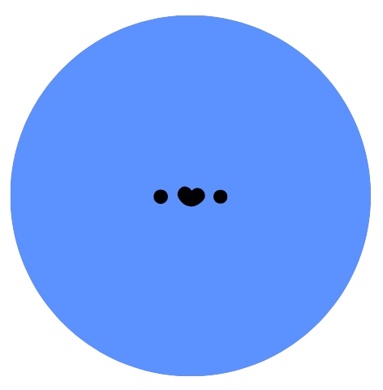

</img>
# Yinix!
The site for teachers, parents, and students.

### Info
🔗 Link: [yinixx.vercel.app](https://yinixx.vercel.app) \
📁 Created: November ‎18, ‎2025, ‏‎4:28:48 PM

# Colours
    --White: hsl(220, 100%, 100%);
    --Dark-White: hsl(220, 75%, 95%);

    /*  Main -> #5c92ff -> Blue */
    --Main: hsl(220, 100%, 68%);
    --Secondary-Main: hsl(200, 100%, 68%);
    --Transparent-Main: hsla(220, 100%, 68%, 10%);

    --Purple-Black: hsl(245, 15%, 68%);
    --Text-Black: hsl(220, 100%, 10%);
    --Text-White: hsl(0, 100%, 99%);
    --Teal-Black: hsl(195, 14%, 50%);
    --Text-Muted: hsl(0, 0%, 50%);
